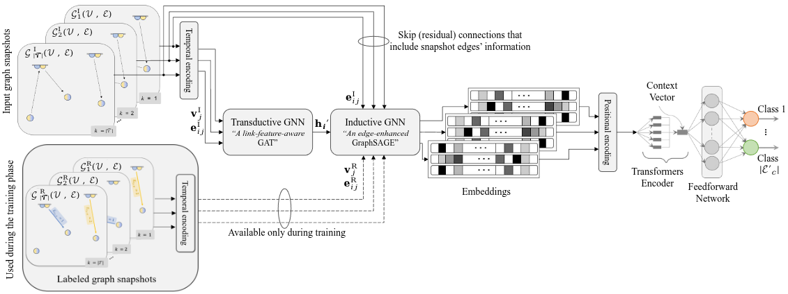

# DGET: Dual-Graph Embedding Transformer for Hybrid RF–OWC IoT Networks

## Overview
This repository provides the complete, reproducible implementation accompanying the paper:  
**“Resource Allocation in Hybrid Radio-Optical IoT Networks using GNN with Multi-task Learning.”**

It implements the **Dual-Graph Embedding with Transformer (DGET)** framework for ressource allocation in a **hybrid Radio Frequency (RF)** and **Optical Wireless Communication (OWC)** IoT networks.  
The framework integrates:

- A **Mixed-Integer Nonlinear Programming (MINLP)** optimization core that generates labeled scheduling datasets under realistic energy and link constraints.  
- A **supervised multi-task deep learning model** combining transductive and inductive Graph Neural Networks (GNNs) with a Transformer encoder to learn **temporal generalization** and **cross-link prediction**.


> **For more information about the MINLP formulation**, its objectives, and constraint design,  
> please refer to our previous repository and paper:  
> - **Code:** [Hybrid RF–OWC AoI Optimization Repository](https://github.com/aymenhamrouni/hybrid-rf-woc-aoi-optimization)  
> - **Paper:** > Hamrouni, A., Pollin, S., & Sallouha, H. (2024). AoI in Context-Aware Hybrid Radio-Optical IoT Networks. In *2024 IEEE Global Communications Conference (GLOBECOM)* (pp. 1966-1972). IEEE. DOI: [10.1109/GLOBECOM52923.2024.10901639](https://doi.org/10.1109/GLOBECOM52923.2024.10901639) 


---

## System Pipeline

### Step 1 – Optimization and Dataset Generation
- **Scripts:** `main.py`, `utils.py`, `MINLP_model.py`
- **Purpose:** Solves a **bi-objective MINLP** that jointly maximizes throughput and minimizes delay under device energy, queue, and link availability constraints.  
- Generates **input graphs (`GI`)** and **recorded graphs (`GR`)** that capture temporal evolution of node energy, queue lengths, and hybrid RF–OWC link states.  
- Stores all labeled datasets as CSV files in the `dataset/` directory.

---

### Step 2 – Dual Graph Embedding and Model Training
- **Scripts:** `train_DGET.py`, `utils_DGET.py`
- **Architecture Overview:**
  - **Transductive GNN (Link-feature-aware GAT):**  
    Learns fine-grained embeddings from fully observed graphs by integrating node, edge, and link-type features.  
    Attention weights are link-feature-dependent, capturing hybrid connectivity patterns.
  - **Inductive GNN (Edge-enhanced GraphSAGE):**  
    Generalizes the transductive embeddings to temporally evolved graph states.  
    It reuses the GAT’s parameters to initialize node representations and is trained using a **consistency loss** to align transductive and recorded embeddings.
  - **Transformer Encoder:**  
    Applies multi-head self-attention on temporally ordered embeddings to capture long-term dependencies and predict per-link technology classes (RF / OWC / none).

---

### Step 3 – Evaluation and Visualization
- Automatically generates:
  - ROC / AUC curves  
  - Confusion matrices (clean and “aged” test data)  
  - Accuracy / loss curves  
  - Energy, AoI, and throughput plots  
- Includes **post-processing correction** via a **top-2 feasibility search** ensuring physically valid link allocations.  
- Saves model results in `/models`.

---

## Model Summary

- **Multi-task learning objective:**
  - *Classification loss* — cross-entropy with class weighting  
  - *Consistency loss* — mean squared alignment of transductive and inductive embeddings  
- **Augmented edge labeling** and **weighted penalties** mitigate class imbalance.  

---

## Model Architecture

[](figures/DGET_architecture.pdf)  
*Figure 1 – High-level architecture of the Dual-Graph Embedding Transformer (DGET) framework (click to open PDF).*

---

## Key Features
- End-to-end **hybrid RF–OWC** simulation and learning pipeline  
- **Dual-stage embedding** with transductive and inductive GNNs  
- **Transformer-based temporal link classifier**  
- **Feasibility-aware post-processing correction**  
- **Near-optimal scheduling** with substantially lower complexity than MINLP  

---

## Dependencies

Install dependencies:
```bash
pip install -r requirements.txt

```
## Project Structure
```
.
├── train_DGET.py          # DGET training, validation, and evaluation
├── utils_DGET.py          # GNN and Transformer modules
├── MINLP_model.py         # MINLP formulation using DOcplex
├── constants.py           # System parameters (RF / OWC)
├── data_generation.py     # Channel & visibility generation
├── main.py                # Optimization and dataset driver
├── utils.py               # MINLP simulation utilities, metrics, and plotting
├── requirements.txt       # Python dependencies
├── .gitignore
├── dataset/               # Generated datasets (CSV files)
└── models/                # Saved models and checkpoints
```
## Configuration Reference
- `main.py`
  - Network: `N_APs`, `N_d`, `Time`, `S_p`, `N_montecarlo`
  - Channel thresholds: `snr_min_rf`, `snr_min_woc`
  - Visualization/verbosity: `VIZ`, `Verbose`
  - Workload: `start`, `end`, `step` (packet sizes)
  - Sim suites: calls `run_APs_simulation` and `run_Nd_simulation`
- `data_generation.py`
  - Draws distances and time-varying SNRs, capacities, energies, message queues
- `MINLP_model.py`
  - DOcplex model with variables: technology selection `x`, message selection `x_m`, status, delays `delta`, unsent counts, and constraints
- `utils.py`
  - Builds CSVs (both input and recorded), computes AoI metrics (per pair and global), energy/throughput plots, and switching analysis
- `DGET_train.py`
  - Set `size` to dataset `N` before running
  - Model: temporal encoder + GAT + (weighted) GraphSAGE + MLP edge classifier
  - Training controls: `epochs`, `n_repeats` (for repeated K-fold), OneCycle LR scheduler, class-weighted loss

  Generated files (columns are produced by the code):
- `dataset/inputNodesFeaturesN.csv`
  - `TimeStep, NodeID, EnergyLevel`
- `dataset/inputEdgesFeaturesN.csv`
  - `TimeStep, SourceNode, TargetNode, SendingStatus, RF_SendEnergy, RF_ReceiveEnergy, WOC_SendEnergy, WOC_ReceiveEnergy, MessageQueueLength, AllowedTechnology`
  - `AllowedTechnology` encodes feasibility: 0=none, 1=RF, 2=WOC, 3=both
- `dataset/recordedNodesFeaturesN.csv`
  - Time-series of energy after applying schedules (`EnergyLevel` per node/time)
- `dataset/recordedEdgesFeaturesN.csv`
  - `TimeStep, SourceNode, TargetNode, SendingStatus, QueueLength, AllowedTechnology, SelectedTechnology, Label`
  - `SelectedTechnology` is 0 (none), 1 (RF), 2 (WOC)
  - `Label` derives from feasibility/selection combinations and is used as the training target


- `docplex` installs from pip. For large scenarios or exact solving, install IBM CPLEX and set environment variables; otherwise small/medium runs can proceed with community behavior. The community docplex package supports only small instances.
For large-scale or exact runs, install the IBM ILOG CPLEX Optimization Studio (academic version) and set:
  export CPLEX_STUDIO_DIR=/path/to/cplex
  export PYTHONPATH=$CPLEX_STUDIO_DIR/cplex/python/3.x/x86-64_linux
- Backend for Matplotlib is set to `TkAgg` in `main.py` and `DGET.py`. Make sure Tk is available or switch the backend if needed.


## Contributing
1. Fork the repository
2. Create a feature branch: `git checkout -b feature/awesome-feature`
3. Commit changes with clear messages: `git commit -m "feat: add awesome feature"`
4. Push the branch: `git push origin feature/awesome-feature`
5. Open a Pull Request describing the motivation, approach, and tests/plots if relevant


## License

This code is provided for research purposes only. All rights reserved. Any use of this code must include proper citation of the original paper.


## Contact
- Aymen Hamrouni: aymen.hamrouni@kuleuven.be
- Sofie Pollin: sofie.pollin@kuleuven.be
- Hazem Sallouha: hazem.sallouha@kuleuven.be